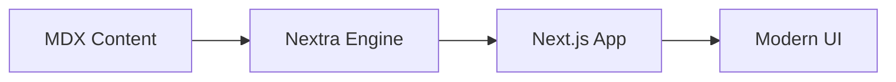

import { Callout, Card, Steps } from '../../components/MDXComponents'

# Architecture Overview

Our documentation is designed with a modern, modular architecture that ensures both ease of use and long-term maintainability.

## Core Principles

- **Performance First**: Minimal JavaScript, optimized assets.
- **Content-Centric**: MDX for flexible, powerful content management.
- **Scalability**: Structure that grows with your project.

  <Card title="Components" href="/en/architecture/components" icon={<svg xmlns="http://www.w3.org/2000/svg" width="18" height="18" viewBox="0 0 24 24" fill="none" stroke="currentColor" strokeWidth="2" strokeLinecap="round" strokeLinejoin="round"><path d="m3 21 1.9-1.9a2.4 2.4 0 0 0 0-3.4l-1.4-1.4a2.4 2.4 0 0 0-3.4 0l-1.9 1.9"></path><path d="m21 3-1.9 1.9a2.4 2.4 0 0 0 0 3.4l1.4 1.4a2.4 2.4 0 0 0 3.4 0L21 3"></path><path d="M3 3h18v18H3z"></path></svg>}>
    Explore the modular components that power our UI.
  </Card>
  <Card title="Data Flow" href="/en/architecture" icon={<svg xmlns="http://www.w3.org/2000/svg" width="18" height="18" viewBox="0 0 24 24" fill="none" stroke="currentColor" strokeWidth="2" strokeLinecap="round" strokeLinejoin="round"><path d="m16 4-4-4-4 4"></path><path d="M12 20v-20"></path><path d="m8 20 4 4 4-4"></path></svg>}>
    Understand how information moves through the system.
  </Card>

<Callout type="success" emoji="🏗️">
  The system is built on top of Next.js 15 App Router, providing the best possible developer experience.
</Callout>

## System Diagram

