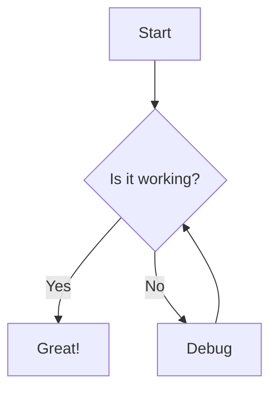

import { Callout, Card, Steps } from '../../../components/MDXComponents'

# Advanced Components

Explore the rich set of components available for your documentation.

## Code Blocks

Nextra supports advanced code blocks with syntax highlighting and line focusing.

```typescript {1, 3-4}
interface User {
  id: string;
  name: string;
  email: string;
  role: 'admin' | 'user';
}

function getUser(id: string): User {
  return { id, name: 'John Doe', email: 'john@example.com', role: 'admin' };
}
```

## Callouts

Use callouts to highlight important information, warnings, or tips.

<Callout type="default">
  A default callout for general information.
</Callout>

<Callout type="warning" emoji="⚠️">
  Use warnings for things that require user attention.
</Callout>

<Callout type="error" emoji="🚫">
  Error callouts for critical failures or misconfigurations.
</Callout>

<Callout type="success" emoji="✅">
  Success callouts for completed tasks or positive outcomes.
</Callout>

## Steps

Guide your users through a process with the Steps component.

<Steps>
### Installation
Install the package using your favorite package manager.
```bash
npm install nextra
```

### Configuration
Add the plugin to your `next.config.js` file.

### Writing Content
Start writing your content in MDX files!
</Steps>

## Diagrams

Visualize complex logic using Mermaid.js integration.


