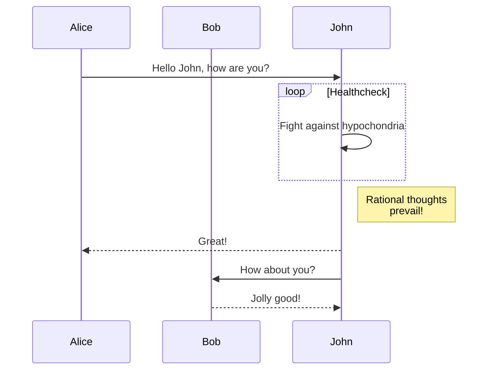
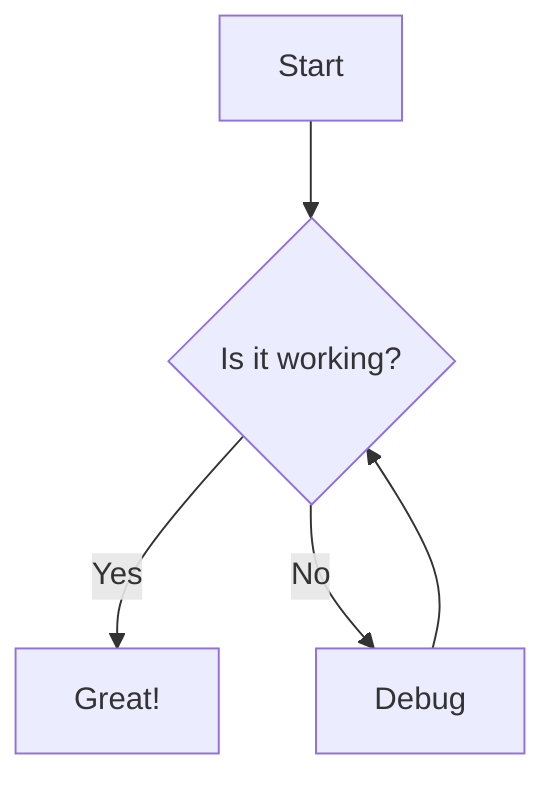

# Mermaid Diagrams

Nextra supports Mermaid diagrams out of the box!

## Sequence Diagram

```mermaid
sequenceDiagram
    participant Alice
    participant Bob
    Alice->>John: Hello John, how are you?
    loop Healthcheck
        John->>John: Fight against hypochondria
    end
    Note right of John: Rational thoughts <br/>prevail!
    John-->>Alice: Great!
    John->>Bob: How about you?
    Bob-->>John: Jolly good!
```

## Flowchart

```mermaid
graph TD
    A[Start] --> B{Is it working?}
    B -- Yes --> C[Great!]
    B -- No --> D[Debug]
    D --> B
```
