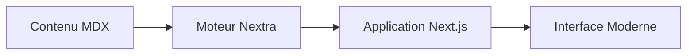

import { Callout, Card, Steps } from '../../components/MDXComponents'

# Vue d'ensemble de l'Architecture

Notre documentation est conçue avec une architecture moderne et modulaire, garantissant à la fois simplicité d'utilisation et maintenabilité à long terme.

## Principes Fondamentaux

- **Performance d'abord** : JavaScript minimal, ressources optimisées.
- **Centré sur le contenu** : MDX pour une gestion flexible et puissante du contenu.
- **Évolutivité** : Une structure qui grandit avec votre projet.

  <Card title="Composants" href="/fr/architecture/components" icon={<svg xmlns="http://www.w3.org/2000/svg" width="18" height="18" viewBox="0 0 24 24" fill="none" stroke="currentColor" strokeWidth="2" strokeLinecap="round" strokeLinejoin="round"><path d="m3 21 1.9-1.9a2.4 2.4 0 0 0 0-3.4l-1.4-1.4a2.4 2.4 0 0 0-3.4 0l-1.9 1.9"></path><path d="m21 3-1.9 1.9a2.4 2.4 0 0 0 0 3.4l1.4 1.4a2.4 2.4 0 0 0 3.4 0L21 3"></path><path d="M3 3h18v18H3z"></path></svg>}>
    Explorez les composants modulaires qui alimentent notre interface.
  </Card>
  <Card title="Flux de données" href="/fr/architecture" icon={<svg xmlns="http://www.w3.org/2000/svg" width="18" height="18" viewBox="0 0 24 24" fill="none" stroke="currentColor" strokeWidth="2" strokeLinecap="round" strokeLinejoin="round"><path d="m16 4-4-4-4 4"></path><path d="M12 20v-20"></path><path d="m8 20 4 4 4-4"></path></svg>}>
    Comprenez comment l'information circule dans le système.
  </Card>

<Callout type="success" emoji="🏗️">
  Le système est construit sur l'App Router de Next.js 15, offrant la meilleure expérience développeur possible.
</Callout>

## Schéma Système

