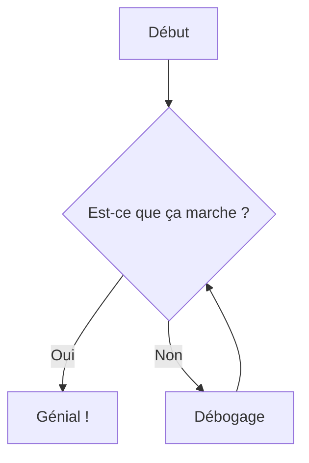

import { Callout, Card, Steps } from '../../../components/MDXComponents'

# Composants Avancés

Explorez l'ensemble des composants riches disponibles pour votre documentation.

## Blocs de Code

Nextra supporte les blocs de code avancés avec coloration syntaxique et mise en évidence de lignes.

```typescript {1, 3-4}
interface User {
  id: string;
  name: string;
  email: string;
  role: 'admin' | 'user';
}

function getUser(id: string): User {
  return { id, name: 'John Doe', email: 'john@example.com', role: 'admin' };
}
```

## Callouts

Utilisez les callouts pour mettre en évidence des informations importantes, des avertissements ou des conseils.

<Callout type="default">
  Un callout par défaut pour les informations générales.
</Callout>

<Callout type="warning" emoji="⚠️">
  Utilisez les avertissements pour les choses qui nécessitent l'attention de l'utilisateur.
</Callout>

<Callout type="error" emoji="🚫">
  Callouts d'erreur pour les défaillances critiques ou les erreurs de configuration.
</Callout>

<Callout type="success" emoji="✅">
  Callouts de succès pour les tâches terminées ou les résultats positifs.
</Callout>

## Étapes

Guidez vos utilisateurs à travers un processus avec le composant Steps.

<Steps>
### Installation
Installez le package à l'aide de votre gestionnaire de paquets préféré.
```bash
npm install nextra
```

### Configuration
Ajoutez le plugin à votre fichier `next.config.js`.

### Rédaction de Contenu
Commencez à rédiger votre contenu dans des fichiers MDX !
</Steps>

## Diagrammes

Visualisez une logique complexe grâce à l'intégration de Mermaid.js.


